# WatchEdge — Camera Software Architecture

> **Scope:** This document describes the software design of the **actual camera module** that runs on the Extreme-Edge device. It replaces the camera-emulator with real inference capabilities while retaining a management WebUI.

---

## 1. High-Level Overview

The camera software is a single Python application composed of two main subsystems that start concurrently:

1. **Inference Engine** — Captures frames from a configurable video source (USB camera or pre-recorded video), runs YOLOv9t ONNX detection, and emits detection events.
2. **WebUI** — A FastAPI server providing a management dashboard (status, live view, logs, configuration).

```text
┌─────────────────────────────────────────────────────────────────────┐
│                         Camera Application                         │
│                                                                    │
│  ┌──────────────┐    ┌──────────────────┐    ┌──────────────────┐  │
│  │ Video Source │───>│ Inference Engine │───>│  Event Pipeline  │  │
│  │  Manager     │    │ (YOLOv9t ONNX)   │    │                  │  │
│  └──────┬───────┘    └────────┬─────────┘    └────────┬─────────┘  │
│         │                     │                       │            │
│         │ frames              │ annotated frames      │ detections │
│         │                     │ + detections          │            │
│         │                     v                       v            │
│         │            ┌──────────────────┐    ┌──────────────────┐  │
│         │            │   Frame Buffer   │    │   MQTT Client    │  │
│         │            │  (latest frame)  │    │  (paho-mqtt v2)  │  │
│         │            └────────┬─────────┘    └──────────────────┘  │
│         │                     │                                    │
│         v                     v                                    │
│  ┌─────────────────────────────────────────────────────────────┐   │
│  │                    WebUI (FastAPI + Jinja2)                 │   │
│  │                                                             │   │
│  │  ┌─────────────┐  ┌──────────────┐  ┌───────────────────┐   │   │
│  │  │  Homepage   │  │Configuration │  │  MJPEG Stream     │   │   │
│  │  │  (status,   │  │ (restart,    │  │  Endpoint         │   │   │
│  │  │   logs)     │  │  MQTT, src)  │  │  /stream          │   │   │
│  │  └─────────────┘  └──────────────┘  └───────────────────┘   │   │
│  └─────────────────────────────────────────────────────────────┘   │
└─────────────────────────────────────────────────────────────────────┘
```

---

## 2. Module Breakdown

### 2.1 `config.py` — Configuration

Frozen dataclass loaded from environment variables. Mirrors the camera-emulator pattern.

**Fields:**

| Field                  | Type    | Default                       | Description                                                                                                                           |
| :--------------------- | :------ | :---------------------------- | :------------------------------------------------------------------------------------------------------------------------------------ |
| `mqtt_host`            | `str`   | `localhost`                   | MQTT broker hostname                                                                                                                  |
| `mqtt_port`            | `int`   | `1883`                        | MQTT broker port                                                                                                                      |
| `mqtt_username`        | `str`   | `""`                          | MQTT credentials                                                                                                                      |
| `mqtt_password`        | `str`   | `""`                          | MQTT credentials                                                                                                                      |
| `mqtt_client_id`       | `str`   | `""`                          | MQTT client ID                                                                                                                        |
| `edge_id`              | `UUID`  | _(required)_                  | Edge device UUID (provisioned at deployment time)                                                                                     |
| `camera_id`            | `UUID`  | _(required)_                  | Camera UUID (provisioned at deployment time)                                                                                          |
| `web_host`             | `str`   | `0.0.0.0`                     | WebUI bind address                                                                                                                    |
| `web_port`             | `int`   | `8080`                        | WebUI bind port                                                                                                                       |
| `model_path`           | `str`   | `model/best_yolov9t_aug.onnx` | Path to ONNX model                                                                                                                    |
| `confidence_threshold` | `float` | `0.6`                         | Minimum detection confidence                                                                                                          |
| `iou_threshold`        | `float` | `0.5`                         | NMS IoU threshold                                                                                                                     |
| `usb_camera_index`     | `int`   | `0`                           | OpenCV VideoCapture device index                                                                                                      |
| `samples_dir`          | `str`   | `samples/`                    | Root directory for bundled sample assets                                                                                              |
| `scenes_file`          | `str`   | `samples/scenes.json`         | Path to sample event scenes JSON file                                                                                                 |
| `default_source`       | `str`   | `usb`                         | Initial video source (`usb` or `video`)                                                                                               |
| `inference_fps`        | `int`   | `15`                          | Target inference framerate                                                                                                            |
| `event_throttle_s`     | `float` | `5.0`                         | Minimum seconds between two published detection events                                                                                |
| `image_dir`            | `str`   | `data/images/`                | Directory for saving captured frames (created on startup if missing)                                                                  |
| `telemetry_interval_s` | `float` | `30.0`                        | Seconds between telemetry heartbeat publishes                                                                                         |
| `birth_*` fields       | various | —                             | Camera registration defaults (edge_name, edge_location as plain string, camera_type, camera_coords, elevation, technical_params_json) |

**Helper:**

- `topic_prefix() -> str` — Returns `edge/{edge_id}/{camera_id}` (both segments are UUIDs, e.g. `edge/a3f1b2c4-...-d5e6/7c8d9e0f-...-a1b2`)

---

### 2.2 `video_source.py` — Video Source Manager

Abstraction over the two supported video inputs. The Inference Engine consumes frames exclusively through this component.

**Class: `VideoSource`**

Wraps an OpenCV `VideoCapture` and exposes a uniform frame-reading interface regardless of source type.

**State:**

| Attribute           | Type                      | Description                                                           |
| :------------------ | :------------------------ | :-------------------------------------------------------------------- | --------------------- |
| `_source_type`      | `Literal["usb", "video"]` | Current active source                                                 |
| `_capture`          | `cv2.VideoCapture         | None`                                                                 | Active OpenCV capture |
| `_lock`             | `threading.Lock`          | Thread-safe access to capture and state                               |
| `_paused`           | `bool`                    | Whether video playback is paused (only meaningful for `video` source) |
| `_usb_index`        | `int`                     | USB camera device index                                               |
| `_available_videos` | `list[dict]`              | List of discovered sample videos (`{"name": ..., "path": ...}`)       |
| `_current_video`    | `str`                     | Filename of the currently selected sample video                       |

**Methods:**

| Method                                 | Description                                                                                                                                                                                                     |
| :------------------------------------- | :-------------------------------------------------------------------------------------------------------------------------------------------------------------------------------------------------------------- | ---------------------------------------------------------------------------------------------------------- |
| `switch(source_type, video_name=None)` | Releases current capture, opens the new source. When switching to `video`, `video_name` selects which sample video to load. If omitted, uses the previously selected video or the first available. Thread-safe. |
| `read() -> tuple[bool, np.ndarray      | None]`                                                                                                                                                                                                          | Returns the next frame. For `video` source when paused, returns the last captured frame without advancing. |
| `pause()`                              | Pauses video playback (no-op for USB).                                                                                                                                                                          |
| `resume()`                             | Resumes video playback (no-op for USB).                                                                                                                                                                         |
| `seek(timestamp_ms: float)`            | Seeks to a specific position in the video file via `CAP_PROP_POS_MSEC`. Only effective when paused. No-op for USB.                                                                                              |
| `get_video_info() -> dict`             | Returns metadata: `source_type`, `current_video`, `is_paused`, `position_ms`, `duration_ms`, `fps`. Duration and position are `None` for USB.                                                                   |
| `list_videos() -> list[dict]`          | Returns the list of available sample videos (`[{"name": ..., "path": ...}, ...]`).                                                                                                                              |
| `release()`                            | Releases the OpenCV capture.                                                                                                                                                                                    |

**Behavior notes:**

- Switching sources is an atomic operation protected by the lock.
- When paused, `read()` always returns the frame at the current seek position without advancing the internal pointer.
- When switching from `video` to `usb`, pause state resets.
- On construction, scans `samples_dir/videos/` for all `.mp4`/`.avi` files and populates `_available_videos`.
- When a video file reaches end-of-file, `read()` returns a **solid black frame** (`ok=True`). The stream goes black and inference sees no detections. The video stays at EOF until the user seeks, switches video, or switches to USB.

---

### 2.3 `detector.py` — Detector

Pure ONNX inference: loads the model once, exposes a single stateless `detect()` method. Contains all pre/postprocessing logic (resize, normalize, NMS, confidence filtering, bounding-box annotation). Separated from the threading concerns of the Inference Engine so the math is testable in isolation.

**Class: `Detector`**

**Dependencies:** `onnxruntime` (or `onnxruntime-gpu`), `cv2`, `numpy`. Note that dependencies are managed explicitly via `uv` using mutually exclusive extras (`cpu`, `nvidia-gpu`, `nvidia-gpu-pascal`) for granular GPU or CPU support, avoiding heavy unneeded artifacts.

**State:**

| Attribute               | Type                   | Description                                               |
| :---------------------- | :--------------------- | :-------------------------------------------------------- |
| `_session`              | `ort.InferenceSession` | Loaded ONNX model session                                 |
| `_execution_provider`   | `str`                  | Chosen execution provider (`CUDAExecutionProvider` etc)   |
| `_input_name`           | `str`                  | Model input tensor name (cached on init)                  |
| `_input_shape`          | `tuple`                | Expected input dimensions `(1, 3, H, W)` (cached on init) |
| `_confidence_threshold` | `float`                | Minimum detection confidence                              |
| `_iou_threshold`        | `float`                | NMS IoU threshold                                         |

**Methods:**

| Method                                                       | Description                                                                                                                                                                                                     |
| :----------------------------------------------------------- | :-------------------------------------------------------------------------------------------------------------------------------------------------------------------------------------------------------------- |
| `detect(frame: np.ndarray) -> tuple[np.ndarray, list[dict]]` | Takes a raw BGR frame, runs the full pipeline (preprocess → infer → postprocess → annotate), and returns `(annotated_frame, detections)`. Pure function over the model weights — no side effects, no threading. |

**Internal helpers (private):**

| Method                                                             | Description                                                                                                                                                                 |
| :----------------------------------------------------------------- | :-------------------------------------------------------------------------------------------------------------------------------------------------------------------------- |
| `_preprocess(frame) -> np.ndarray`                                 | BGR→RGB, resize to model input shape, normalize to `[0, 1]`, transpose to CHW, add batch dimension.                                                                         |
| `_postprocess(frame, raw_output) -> tuple[np.ndarray, list[dict]]` | Decodes raw model output into boxes, applies confidence filtering and NMS, draws bounding boxes and labels on a copy of the frame, returns `(annotated_frame, detections)`. |

**Detection output format** (per detection):

```python
{
    "animal_type": "boar",        # "Wild Boar" | "Wolf" | "Deer" → normalized to MQTT schema names
    "confidence": 0.92,
    "distance": ...,              # Estimated from bbox size (heuristic)
    "size_estimate": ...,         # Estimated from bbox dimensions (heuristic)
    "box": [x, y, w, h]          # Pixel coordinates
}
```

---

### 2.4 `inference_engine.py` — Inference Engine

Threaded loop that reads frames from the VideoSource, delegates to the Detector, and manages the shared frame buffer and detection callbacks. Runs in a **dedicated daemon thread** to avoid blocking the WebUI.

**Class: `InferenceEngine`**

**Dependencies:** `Detector`, `VideoSource`

**State:**

| Attribute            | Type             | Description                                     |
| :------------------- | :--------------- | :---------------------------------------------- | ------------------------------------------------------- |
| `_detector`          | `Detector`       | The detection model                             |
| `_video_source`      | `VideoSource`    | Frame provider                                  |
| `_running`           | `bool`           | Engine loop control flag                        |
| `_target_fps`        | `int`            | Target inference framerate                      |
| `_latest_frame`      | `np.ndarray      | None`                                           | Most recent annotated frame (with bounding boxes drawn) |
| `_latest_detections` | `list[dict]`     | Most recent detection results                   |
| `_frame_lock`        | `threading.Lock` | Guards `_latest_frame` and `_latest_detections` |
| `_on_detection`      | `Callable        | None`                                           | Callback invoked when detections are found              |

**Methods:**

| Method                                  | Description                                                                                                                             |
| :-------------------------------------- | :-------------------------------------------------------------------------------------------------------------------------------------- | --------------------------------------------------------------------------------------------- |
| `start()`                               | Starts the inference loop in a daemon thread.                                                                                           |
| `stop()`                                | Signals the loop to stop and waits for the thread to join.                                                                              |
| `get_latest_frame() -> bytes            | None`                                                                                                                                   | Returns the latest annotated frame JPEG-encoded (thread-safe read). Used by the MJPEG stream. |
| `get_latest_detections() -> list[dict]` | Returns the latest detection list (thread-safe read).                                                                                   |
| `on_detection(callback)`                | Registers a callback `fn(detections: list[dict], frame: np.ndarray)` invoked each time the engine produces detections with `count > 0`. |

**Inference loop (pseudocode):**

```python
while _running:
    ok, frame = _video_source.read()
    if not ok:
        sleep briefly, continue

    annotated, detections = _detector.detect(frame)

    with _frame_lock:
        _latest_frame = annotated
        _latest_detections = detections

    if detections and _on_detection:
        _on_detection(detections, frame)

    sleep to maintain target FPS
```

---

### 2.5 `event_pipeline.py` — Event Pipeline

Bridges the Inference Engine output to the MQTT client. Responsible for assembling detection events into the MQTT payload format, generating event IDs, and throttling to avoid flooding the broker with redundant events.

**Class: `EventPipeline`**

**Dependencies:** `MQTTClient`, `Config`

**State:**

| Attribute          | Type         | Description                                                                                  |
| :----------------- | :----------- | :------------------------------------------------------------------------------------------- |
| `_mqtt`            | `MQTTClient` | MQTT publishing interface                                                                    |
| `_cfg`             | `Config`     | Camera configuration                                                                         |
| `_last_event_time` | `float`      | Timestamp of last published event (for throttling)                                           |
| `_image_dir`       | `Path`       | Directory where captured frames are saved as `{event_id}.jpg` for upload command fulfillment |

**Methods:**

| Method                                    | Description                                                                                                                                                                                                                                                                                                                                                                                                  |
| :---------------------------------------- | :----------------------------------------------------------------------------------------------------------------------------------------------------------------------------------------------------------------------------------------------------------------------------------------------------------------------------------------------------------------------------------------------------------- |
| `handle_detections(detections, frame)`    | Registered as the Inference Engine callback. Applies throttling, builds the event payload conforming to the MQTT spec, generates a UUID `event_id` (plain UUID, no prefix), saves the frame as `{event_id}.jpg` in `_image_dir`, and publishes to `{prefix}/event`. The `count` field is included for informational purposes only — the DB trigger `trg_refresh_count` always recomputes it from child rows. |
| `handle_upload_cmd(event_id, upload_url)` | Called when a `cmd/upload` is received. Reads the image file `{event_id}.jpg` from `_image_dir`, uploads it via HTTP PUT to `upload_url`, and publishes `upload_status` with `remote_path` on success or `message` on error (matching the MQTT_Mapping.md §4 payload). Runs in a background thread to avoid blocking the MQTT callback.                                                                      |

**Event payload** (as per MQTT_Mapping.md):

```json
{
  "event_id": "{UUID}",
  "capture_time": "2026-03-01T12:00:00Z",
  "count": 1,
  "detections": [
    {
      "animal_type": "boar",
      "distance": 15.5,
      "size_estimate": 1.2,
      "confidence": 0.92
    }
  ]
}
```

> **Note:** `count` is informational only. The database trigger `trg_refresh_count` always recomputes it from the actual number of `animaldetected` child rows.

---

### 2.6 `mqtt_client.py` — MQTT Client

Same design as the camera-emulator's MQTT client. Handles the full MQTT lifecycle for the Extreme-Edge device.

**Class: `MQTTClient`**

Reuses the same pattern from the emulator — thin wrapper around `paho.mqtt.client` v2 with structured logging, callback registration, and thread-safe state.

**Publishes to:**

| Topic                          | QoS  | Retained | Trigger                          |
| :----------------------------- | :--- | :------- | :------------------------------- |
| `{prefix}/lifecycle/birth`     | 1    | Yes      | On connect (auto)                |
| `{prefix}/telemetry`           | 1    | Yes      | Periodic (configurable interval) |
| `{prefix}/event`               | 1    | No       | On detection (via EventPipeline) |
| `{prefix}/event/upload_status` | 1    | No       | After upload attempt             |

**Subscribes to:**

| Topic                 | Handler                                     |
| :-------------------- | :------------------------------------------ |
| `{prefix}/cmd/upload` | Routes to `EventPipeline.handle_upload_cmd` |

**LWT:** `{"status": "Offline"}` on `{prefix}/telemetry`

**Birth payload** (per MQTT_Mapping.md):

```json
{
  "edge_name": "SAN_ROSSORE_PACK_01",
  "edge_location": "San Rossore Forest",
  "camera_type": "BOAR_CAMERA_V3",
  "camera_coords": "POINT(10.324982, 43.76797)",
  "elevation": 30,
  "technical_params_json": {
    "iso": 800,
    "res": "2160x3840"
  }
}
```

All values are sourced from the `birth_*` fields in `Config`.

**Telemetry payload** (per MQTT_Mapping.md):

```json
{
  "timestamp": "2026-03-01T10:00:00Z",
  "status": "Online",
  "temperature": 17.5,
  "battery_level": 74
}
```

**Telemetry loop:** A background thread periodically publishes the above heartbeat. `timestamp` is generated at publish time (ISO-8601). Temperature and battery can be read from hardware sensors if available, or default to placeholder values.

**Methods (same interface as the emulator):**

| Method                                            | Description                                                                                                                                            |
| :------------------------------------------------ | :----------------------------------------------------------------------------------------------------------------------------------------------------- |
| `start()`                                         | Connects to broker, starts background loop, auto-publishes birth.                                                                                      |
| `stop()`                                          | Publishes `{"status": "Offline"}` telemetry, disconnects gracefully.                                                                                   |
| `publish_birth()`                                 | Sends retained registration message.                                                                                                                   |
| `publish_telemetry()`                             | Sends retained heartbeat.                                                                                                                              |
| `publish_event(payload)`                          | Sends detection event.                                                                                                                                 |
| `publish_upload_status(event_id, status, detail)` | Sends upload result. On `SUCCESS`, `detail` is the `remote_path`. On `ERROR`, `detail` is the error `message`. Payload conforms to MQTT_Mapping.md §4. |
| `is_connected() -> bool`                          | Thread-safe connection state check.                                                                                                                    |
| `on_command(callback)`                            | Registers handler for incoming `cmd/upload` messages.                                                                                                  |
| `on_log_event(callback)`                          | Registers handler for structured MQTT event logs (for the WebUI log viewer).                                                                           |

---

### 2.7 `web.py` — WebUI (FastAPI)

Serves the two HTML pages (**Homepage** and **Configuration**), the MJPEG live stream, and the homepage data endpoints. Presentation-facing only — all control/configuration REST endpoints live in `WebAPI`.

**Class: `WebUI`**

**Dependencies:** `FastAPI`, `Jinja2Templates`, `InferenceEngine`, `MQTTClient`, `Config`

#### Routes owned by WebUI

| Method | Endpoint         | Description                                                                                                                                                                                                            |
| :----- | :--------------- | :--------------------------------------------------------------------------------------------------------------------------------------------------------------------------------------------------------------------- |
| `GET`  | `/`              | Renders the Homepage template.                                                                                                                                                                                         |
| `GET`  | `/configuration` | Renders the Configuration page template.                                                                                                                                                                               |
| `GET`  | `/stream`        | MJPEG streaming response. Continuously yields the latest annotated frame from the Inference Engine as a `multipart/x-mixed-replace` stream. This is what the Homepage embeds as a live view via ``. |
| `GET`  | `/api/status`    | Returns camera status JSON: `mqtt_connected`, `edge_id`, `camera_id`, `source_type`, `current_video`, `is_paused`, `inference_running`.                                                                                |
| `GET`  | `/api/log`       | Returns the recent MQTT event log (same deque-based pattern as the emulator, capped at 200 entries).                                                                                                                   |

#### MJPEG Stream Implementation

The `/stream` endpoint is a `StreamingResponse` with `media_type="multipart/x-mixed-replace; boundary=frame"`. It runs a generator that:

1. Calls `InferenceEngine.get_latest_frame()` to get the latest JPEG-encoded annotated frame.
2. Yields it as a MIME part.
3. Sleeps briefly (targeting ~15 FPS for the stream, independent of inference FPS).
4. Repeats until the client disconnects.

This approach works universally in all browsers without JavaScript or WebSocket dependencies.

---

### 2.8 `api.py` — WebAPI (FastAPI APIRouter)

All control and configuration REST endpoints, mounted as a sub-router on the FastAPI app created by `WebUI`. Separated from the presentation layer so the route handlers and the templates/streaming logic each stay well under the file-size budget.

**Class: `WebAPI`**

**Dependencies:** `InferenceEngine`, `MQTTClient`, `VideoSource`, `EventPipeline`, `Config`

#### Routes owned by WebAPI

| Method | Endpoint               | Description                                                                                                                                              |
| :----- | :--------------------- | :------------------------------------------------------------------------------------------------------------------------------------------------------- | ------------------------------------------------------------------------------------------------------------------------------------------------------ |
| `GET`  | `/health`              | Health check — returns `mqtt_connected`, `inference_running`, `source_type`.                                                                             |
| `POST` | `/api/restart`         | Stops the Inference Engine and MQTT client, then restarts them. Returns success/failure.                                                                 |
| `POST` | `/api/mqtt/disconnect` | Gracefully disconnects the MQTT client.                                                                                                                  |
| `POST` | `/api/mqtt/reconnect`  | Reconnects the MQTT client to the broker.                                                                                                                |
| `POST` | `/api/source/switch`   | Switches video source. Body: `{"source": "usb"                                                                                                           | "video", "video_name": "sample_01.mp4"}`. The`video_name`field is optional and only used when switching to`video`. Delegates to`VideoSource.switch()`. |
| `POST` | `/api/source/pause`    | Pauses video playback.                                                                                                                                   |
| `POST` | `/api/source/resume`   | Resumes video playback.                                                                                                                                  |
| `POST` | `/api/source/seek`     | Seeks in paused video. Body: `{"timestamp_ms": 12345}`.                                                                                                  |
| `GET`  | `/api/source/info`     | Returns `VideoSource.get_video_info()` (source type, current video name, paused state, position, duration).                                              |
| `GET`  | `/api/source/videos`   | Returns the list of available sample videos from `VideoSource.list_videos()`.                                                                            |
| `GET`  | `/api/scenes`          | Returns the list of sample event scenes loaded from `scenes.json`.                                                                                       |
| `POST` | `/api/event/inject`    | Injects an MQTT event. Body: `{"scene_index": 0}` to use a predefined scene, or a full custom event payload. Publishes via `MQTTClient.publish_event()`. |
| `POST` | `/api/birth`           | Publishes a custom birth message (same as emulator).                                                                                                     |
| `POST` | `/api/telemetry`       | Publishes a custom telemetry message (same as emulator).                                                                                                 |

---

### 2.9 `templates/` — Jinja2 HTML Templates

Two templates, both using Tailwind CSS (CDN) and a dark theme consistent with the camera-emulator's visual style.

#### `homepage.html`

Three sections stacked vertically:

| Section         | Content                                                                                                                                                       |
| :-------------- | :------------------------------------------------------------------------------------------------------------------------------------------------------------ |
| **Status Bar**  | Connection badge (MQTT connected/disconnected), Edge ID, Camera ID, current video source indicator. Polled via `GET /api/status` on a short interval.         |
| **Live View**   | An `` tag with `src="/stream"`. Displays the real-time annotated inference output. No JavaScript needed — the browser handles the MJPEG stream natively. |
| **System Logs** | Scrollable log panel showing MQTT events (direction, topic, payload, timestamp). Polled via `GET /api/log`. Same presentation as the camera-emulator.         |

#### `configuration.html`

Four card sections:

| Section              | Controls                                                                                                                                                                                                                                                                                                                                                                                                                                                                                                                                                                                                 |
| :------------------- | :------------------------------------------------------------------------------------------------------------------------------------------------------------------------------------------------------------------------------------------------------------------------------------------------------------------------------------------------------------------------------------------------------------------------------------------------------------------------------------------------------------------------------------------------------------------------------------------------------- |
| **Software Restart** | A single "Restart Camera Software" button. Calls `POST /api/restart`. Shows a brief "Restarting..." indicator.                                                                                                                                                                                                                                                                                                                                                                                                                                                                                           |
| **MQTT Connection**  | "Disconnect" and "Reconnect" buttons. Reflects current state. Calls `POST /api/mqtt/disconnect` and `POST /api/mqtt/reconnect`.                                                                                                                                                                                                                                                                                                                                                                                                                                                                          |
| **Video Source**     | Radio toggle: `USB Camera` / `Pre-recorded Video`. On switch, calls `POST /api/source/switch`. When `video` is selected, shows: (1) a **dropdown to select which sample video** to play (populated from `GET /api/source/videos`), (2) a Play/Pause toggle button, and (3) a range slider (timestamp scrubber) displaying current position and total duration. The scrubber is only interactive when paused. Position and duration are polled from `GET /api/source/info`. Seeking calls `POST /api/source/seek`. Changing the video dropdown calls `POST /api/source/switch` with the new `video_name`. |
| **Inject Event**     | A **dropdown of sample event scenes** (populated from `GET /api/scenes`, loaded from the bundled `scenes.json`). Each scene has a name, description, and predefined detection payload — same structure as the camera-emulator's scenes. Selecting a scene and clicking "Send" calls `POST /api/event/inject {"scene_index": N}`. Below the dropdown, there is also an expandable **custom event form** allowing manual entry of `count` and detections (`animal_type`, `distance`, `size_estimate`, `confidence`). Also includes manual Birth and Telemetry publishing forms.                            |

---

### 2.10 `main.py` — Application Entry Point

Orchestrates startup and wiring of all components.

**Startup sequence:**

```text
1.  Load Config from environment variables
2.  Load sample scenes from scenes_file JSON
3.  Discover available sample videos from samples_dir/videos/
4.  Create VideoSource(usb_index, available_videos, default_source)
5.  Create Detector(model_path, confidence, iou)
6.  Create InferenceEngine(detector, video_source, fps)
7.  Create MQTTClient(config)
8.  Create EventPipeline(mqtt_client, config)
9.  Register EventPipeline.handle_detections as InferenceEngine.on_detection callback
10. Register EventPipeline.handle_upload_cmd as MQTTClient.on_command callback
11. Create WebUI(config, mqtt, inference_engine)
12. Create WebAPI(inference_engine, mqtt, video_source, event_pipeline, config, scenes)
13. Mount WebAPI router onto WebUI app
14. Register MQTTClient.on_log_event → WebUI log deque
15. Start Inference Engine (daemon thread)
16. Start MQTT Client (background loop, ignore initial connection errors)
17. Start FastAPI/Uvicorn (blocks on main thread)
```

**Shutdown:** On `SIGINT`/`SIGTERM`, stops the Inference Engine, MQTT client, and releases the VideoSource.

---

## 3. File Structure

```text
src/services/camera/
├── Dockerfile
├── main.py                          # Entry point (same pattern as emulator)
├── pyproject.toml
├── README.md
├── model/
│   └── best_yolov9t_aug.onnx       # Bundled YOLOv9t ONNX model
├── samples/
│   ├── scenes.json                  # Sample event scenes for diagnostics
│   └── videos/
│       ├── sample_01.mp4            # Pre-recorded sample video(s)
│       └── ...                      # Additional sample videos
├── data/
│   └── images/                      # Captured frames saved as {event_id}.jpg (runtime)
└── camera/
    ├── __init__.py
    ├── config.py
    ├── video_source.py
    ├── detector.py
    ├── inference_engine.py
    ├── event_pipeline.py
    ├── mqtt_client.py
    ├── web.py
    ├── api.py
    └── templates/
        ├── homepage.html
        └── configuration.html
```

---

## 4. Dependencies

| Package             | Purpose                                           |
| :------------------ | :------------------------------------------------ |
| `fastapi`           | WebUI HTTP framework                              |
| `uvicorn[standard]` | ASGI server                                       |
| `paho-mqtt`         | MQTT v5 client (v2 API)                           |
| `jinja2`            | HTML templating                                   |
| `requests`          | HTTP uploads to Object Storage                    |
| `opencv-python`     | Video capture (USB + file) and frame manipulation |
| `numpy`             | Image array operations                            |
| `onnxruntime`       | YOLOv9t model inference                           |

---

## 5. Threading Model

```text
Main Thread          ─── Uvicorn / FastAPI (blocking)
                          ├── HTTP request handlers
                          └── /stream MJPEG generator (one per connected client)

Inference Thread     ─── InferenceEngine.run() (daemon)
                          └── read frame → Detector.detect() → update buffer → callback

MQTT Loop Thread     ─── paho-mqtt network loop (daemon, started by loop_start())
                          ├── Publishes: birth, telemetry, event, upload_status
                          └── Receives: cmd/upload → dispatches to EventPipeline

Telemetry Thread     ─── Periodic telemetry publisher (daemon)
                          └── sleep(interval) → publish_telemetry()

Upload Threads       ─── Spawned per cmd/upload (daemon, short-lived)
                          └── HTTP PUT image → publish upload_status
```

All shared state (`_latest_frame`, `_latest_detections`, MQTT connection flag, VideoSource capture) is protected by `threading.Lock`.

---

## 6. Data Flow Diagrams

### 6.1 Detection → MQTT Event

```text
VideoSource ──frame──> InferenceEngine ──detections──> EventPipeline ──publish──> MQTTClient
                             │                              │                        │
                             │                              │                        v
                             v                              │               edge/{eid}/{cid}/event
                       Frame Buffer                         │
                       (for /stream)                        v
                                                   _image_dir/{event_id}.jpg
```

### 6.2 Upload Command Flow

```text
MQTTClient <──cmd/upload── MQTT Broker
     │
     v
EventPipeline.handle_upload_cmd(event_id, upload_url)
     │
     ├── Read JPEG from _image_dir/{event_id}.jpg
     ├── HTTP PUT → Edge Object Storage (upload_url)
     │
     └── MQTTClient.publish_upload_status(event_id, SUCCESS/ERROR)
```

### 6.3 Live View (MJPEG)

```text
Browser 
     │
     v
FastAPI GET /stream (StreamingResponse)
     │
     └── loop:
           InferenceEngine.get_latest_frame() → JPEG bytes
           yield as multipart boundary frame
           sleep(~66ms)
```

---

## 7. Video Source Switching — Behavior Spec

| Action              | USB Source                                                        | Video Source                                                                                                                 |
| :------------------ | :---------------------------------------------------------------- | :--------------------------------------------------------------------------------------------------------------------------- |
| **Switch to USB**   | No-op                                                             | Releases video capture, opens USB device. Resets pause state.                                                                |
| **Switch to Video** | Releases USB capture, opens selected sample video from beginning. | If a different `video_name` is specified, releases current video and opens the new one from beginning. Same name is a no-op. |
| **Select Video**    | Ignored                                                           | Switches to the chosen sample video (calls `switch("video", video_name)`). Resets to beginning of the new file.              |
| **Pause**           | Ignored                                                           | Freezes playback. `read()` returns the current frame repeatedly.                                                             |
| **Resume**          | Ignored                                                           | Resumes playback from current position.                                                                                      |
| **Seek**            | Ignored                                                           | Only works when paused. Sets `CAP_PROP_POS_MSEC`. Next `read()` returns the frame at the new position.                       |

The Inference Engine does not need to know which source is active — it always calls `VideoSource.read()` and processes whatever frame is returned. The MJPEG stream and detections reflect the active source seamlessly.

---

## 8. WebUI Polling Intervals

| Endpoint               | Polling Interval | Consumer                              |
| :--------------------- | :--------------- | :------------------------------------ |
| `GET /api/status`      | 2 s              | Homepage status bar                   |
| `GET /api/log`         | 3 s              | Homepage log panel                    |
| `GET /api/source/info` | 1 s              | Configuration video scrubber position |

The MJPEG stream (`/stream`) is continuous and does not use polling.

---

## 9. Bundled Assets — Container Contents

The Docker image ships with all assets needed to operate without external dependencies beyond the MQTT broker and Object Storage:

| Asset                   | Container Path                | Description                                                                                                                                                                                                                                                                                                                              |
| :---------------------- | :---------------------------- | :--------------------------------------------------------------------------------------------------------------------------------------------------------------------------------------------------------------------------------------------------------------------------------------------------------------------------------------- |
| **ONNX Model**          | `model/best_yolov9t_aug.onnx` | YOLOv9t model trained for wildlife detection (Wild Boar, Wolf, Deer). Small enough to bundle directly (~15 MB).                                                                                                                                                                                                                          |
| **Sample Videos**       | `samples/videos/*.mp4`        | One or more pre-recorded video files of wildlife scenes. Used as an alternative to the USB camera input for demo, testing, and diagnostics. The user selects which video to play from the Configuration page dropdown.                                                                                                                   |
| **Sample Event Scenes** | `samples/scenes.json`         | A JSON array of predefined detection events for diagnostics injection, following the same structure as the camera-emulator's `demo_scenes/scenes.json`. Each scene contains a `name`, `description`, `count`, and a `detections` array. The user selects a scene from the Configuration page dropdown and publishes it as an MQTT event. |

### `scenes.json` Format

```json
[
  {
    "name": "Demo scene 1",
    "description": "One large boar",
    "count": 1,
    "detections": [
      {
        "animal_type": "boar",
        "distance": 39.7,
        "size_estimate": 1.2,
        "confidence": 0.96
      }
    ]
  }
]
```

Scenes do **not** include a `photo` field (unlike the emulator) — the camera stores the actual inference frame for any `cmd/upload` request, so sample events don't need pre-baked images.

---

## 10. Error Handling & Degradation

| Failure                                | Behavior                                                                                                                                                                                                 |
| :------------------------------------- | :------------------------------------------------------------------------------------------------------------------------------------------------------------------------------------------------------- |
| **MQTT broker unreachable on startup** | The WebUI and Inference Engine start normally. The status bar shows "Disconnected". The failed connection attempt is logged in the system log panel.                                                     |
| **MQTT broker disconnects at runtime** | LWT fires automatically. The status bar reflects "Disconnected". The log shows the disconnection event. Inference continues (detections are produced but not published).                                 |
| **MQTT reconnect**                     | User clicks "Reconnect" on the Configuration page, or the application can attempt auto-reconnect (paho-mqtt built-in). On success, birth is re-published and telemetry resumes.                          |
| **USB camera unavailable**             | `VideoSource.read()` returns `ok=False`. The Inference Engine produces no frames — the MJPEG stream shows the last frame or nothing. The log records the error. Switching to a sample video still works. |
| **Video file EOF**                     | `read()` returns a solid black frame. The stream goes black, no detections fire. The user can seek, switch video, or switch to USB.                                                                      |

---

## 11. Docker Notes

The Dockerfile follows the same pattern as the camera-emulator (Python 3.12-slim + `uv`). Key additions:

- **USB camera passthrough:** The container requires access to the host's video device. In `docker-compose.yml`, this means:

  ```yaml
  devices:
    - /dev/video0:/dev/video0
  ```

- **Model and samples are COPYed** into the image at build time (they are small enough to bundle directly).
- **Port 8080** is exposed for the WebUI.

---

## 12. Class Diagram

```mermaid
classDiagram
    direction LR

    class Config {
        <<frozen dataclass>>
        +str mqtt_host
        +int mqtt_port
        +str mqtt_username
        +str mqtt_password
        +str mqtt_client_id
        +str edge_id
        +str camera_id
        +str web_host
        +int web_port
        +str model_path
        +float confidence_threshold
        +float iou_threshold
        +int usb_camera_index
        +str samples_dir
        +str scenes_file
        +str default_source
        +int inference_fps
        +float event_throttle_s
        +float telemetry_interval_s
        +str birth_edge_name
        +str birth_edge_location
        +str birth_camera_type
        +str birth_camera_coords
        +float birth_elevation
        +str birth_technical_params_json
        +topic_prefix() str
    }

    class VideoSource {
        -Literal _source_type
        -VideoCapture _capture
        -Lock _lock
        -bool _paused
        -int _usb_index
        -list~dict~ _available_videos
        -str _current_video
        +switch(source_type, video_name) void
        +read() tuple~bool, ndarray~
        +pause() void
        +resume() void
        +seek(timestamp_ms: float) void
        +get_video_info() dict
        +list_videos() list~dict~
        +release() void
    }

    class Detector {
        -InferenceSession _session
        -str _input_name
        -tuple _input_shape
        -float _confidence_threshold
        -float _iou_threshold
        +detect(frame: ndarray) tuple~ndarray, list~
        -_preprocess(frame: ndarray) ndarray
        -_postprocess(frame: ndarray, raw_output) tuple~ndarray, list~
    }

    class InferenceEngine {
        -Detector _detector
        -VideoSource _video_source
        -bool _running
        -int _target_fps
        -ndarray _latest_frame
        -list~dict~ _latest_detections
        -Lock _frame_lock
        -Callable _on_detection
        +start() void
        +stop() void
        +get_latest_frame() bytes
        +get_latest_detections() list~dict~
        +on_detection(callback: Callable) void
    }

    class EventPipeline {
        -MQTTClient _mqtt
        -Config _cfg
        -float _last_event_time
        -Path _image_dir
        +handle_detections(detections: list, frame: ndarray) void
        +handle_upload_cmd(event_id: str, upload_url: str) void
    }

    class MQTTClient {
        -Client _client
        -Config _cfg
        -bool _connected
        -Lock _conn_lock
        -Callable _on_command
        -Callable _on_log_event
        +start() void
        +stop() void
        +publish_birth() void
        +publish_telemetry() void
        +publish_event(payload: dict) void
        +publish_upload_status(event_id: str, status: str, detail: str) void
        +is_connected() bool
        +on_command(callback: Callable) void
        +on_log_event(callback: Callable) void
    }

    class WebUI {
        -FastAPI _app
        -Jinja2Templates _templates
        -Config _cfg
        -MQTTClient _mqtt
        -InferenceEngine _engine
        -deque _log_entries
        +create_app() FastAPI
    }

    class WebAPI {
        -APIRouter _router
        -InferenceEngine _engine
        -MQTTClient _mqtt
        -VideoSource _video_source
        -EventPipeline _pipeline
        -Config _cfg
        -list~dict~ _scenes
        +get_router() APIRouter
    }

    %% ── Aggregation: components hold references passed at construction ──
    InferenceEngine o-- Detector : _detector
    InferenceEngine o-- VideoSource : _video_source
    EventPipeline o-- MQTTClient : _mqtt
    EventPipeline o-- Config : _cfg
    WebUI o-- Config : _cfg
    WebUI o-- MQTTClient : _mqtt
    WebUI o-- InferenceEngine : _engine
    WebAPI o-- InferenceEngine : _engine
    WebAPI o-- MQTTClient : _mqtt
    WebAPI o-- VideoSource : _video_source
    WebAPI o-- EventPipeline : _pipeline
    WebAPI o-- Config : _cfg

    %% ── Callback wiring (done in main.py) ──
    InferenceEngine ..> EventPipeline : on_detection callback
    MQTTClient ..> EventPipeline : on_command callback
    MQTTClient ..> WebUI : on_log_event callback

    %% ── Router mounting (done in main.py) ──
    WebUI ..> WebAPI : includes router
```



### Reading the Diagram

| Relationship         | UML Notation          | Meaning                                                                                                                                                                                             |
| :------------------- | :-------------------- | :-------------------------------------------------------------------------------------------------------------------------------------------------------------------------------------------------- |
| `o--` (open diamond) | Aggregation           | The source class holds a reference to the target, received via constructor injection. Neither class owns the other's lifecycle — `main.py` creates all instances and passes them in.                |
| `..>` (dashed arrow) | Dependency / callback | A runtime dependency established through callback registration or router mounting. The arrow points from the **caller** to the **callee**. These are wired in `main.py` during startup (see §2.10). |

### Notes

- **`Config`** is a frozen dataclass — immutable after construction. Every other component receives it read-only.
- **`main.py`** (§2.10) is not a class. It is the procedural entry point that instantiates all eight classes above, wires callbacks, mounts the `WebAPI` router, and starts the application. It does not appear in the diagram because it holds no state and exposes no interface.
- **No inheritance** is used. All classes are concrete; no abstract base classes are needed at this level of complexity.
